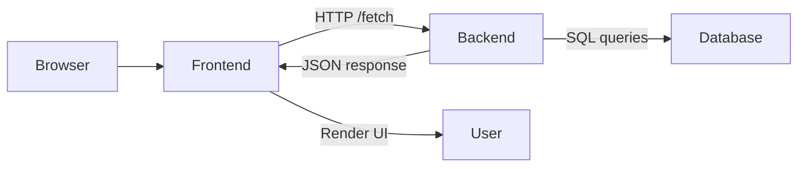

# Campus Connect 🚀

A campus communication platform built with Next.js frontend and Express/MySQL backend, designed to manage notices, events, comments, and role-based access for students and administrators.


---

# Project Overview 💡

- What the project does
  Campus Connect lets campus users register/login, view campus notices, browse upcoming events, comment on notices, and perform admin actions like creating events and notices.

- Why it was built
  To centralize campus announcements and event management in a single platform with secure authentication and role-based controls.

- Who uses it
  Students and campus admins/faculty.

- Problem it solves
  Reduces scattered communication by providing a dedicated dashboard for campus notices, event listings, and admin-managed content.

---

# Key Features ✨

## User Features 👥

- ✅ Register and log in
- 📰 View campus notices
- 📅 View upcoming events
- 📄 Read notice details
- 💬 Post comments on notices
- 👤 View profile and account info

## Admin Features 🛠️

- 🆕 Create events
- 🗑️ Delete events
- 📝 Create notices
- ✏️ Update/delete notices
- 📊 Access dashboard statistics
- 🔐 Role-based access control for admin-only actions

## System Features 🧩

- 🔐 JWT authentication
- 🔒 Protected API routes
- 🧾 Role authorization middleware
- 🗄️ MySQL database connectivity with connection pooling
- ⚡ Client-side state and form handling
- 📡 Centralized frontend API utility + fetch usage

---

# Application Workflow 🔄

1. 🌐 User opens the Next.js frontend in a browser.
2. 🧾 User registers or logs in through `/register` or `/login`.
3. 📤 Frontend sends credentials to backend `/api/auth/register` or `/api/auth/login`.
4. 🛡️ Backend validates input, hashes passwords, or verifies credentials.
5. 🔑 Backend returns a JWT token after successful login.
6. 💾 Frontend stores the token and user profile in `localStorage`.
7. 📁 User requests protected data from frontend pages (`/dashboard`, `/notices`, `/events`).
8. 📡 Frontend calls backend APIs with `Authorization: Bearer <token>`.
9. ✅ Backend middleware validates the JWT, attaches `req.user`, and authorizes roles.
10. 🧠 Backend executes MySQL queries to read or modify data.
11. 📦 Backend returns JSON responses.
12. 🎨 Frontend renders notices, events, dashboard stats, or comments.

---

# Technology Stack 🧪

| Technology   | Purpose                                |
| ------------ | -------------------------------------- |
| Next.js      | Frontend framework and routing         |
| React        | UI component rendering                 |
| Axios        | HTTP client for API calls              |
| Express      | Backend server and API routing         |
| MySQL        | Relational database                    |
| mysql2       | Node MySQL driver with promise support |
| bcryptjs     | Password hashing                       |
| jsonwebtoken | JWT authentication                     |
| dotenv       | Environment variable handling          |
| CORS         | Allow browser requests from frontend   |
| Tailwind CSS | Styling classes in frontend            |

---

# System Architecture

The app is split into frontend, backend, and database layers.



---

## 📂 Project Structure

```text
campus_connect/
├── backend/
│   ├── config/
│   │   ├── db.js
│   │   └── schema.sql
│   ├── controllers/
│   │   ├── authController.js
│   │   ├── dashboardController.js
│   │   ├── eventController.js
│   │   └── noticeController.js
│   ├── middleware/
│   │   └── authMiddleware.js
│   ├── models/
│   │   └── Notice.js
│   ├── routes/
│   │   ├── authRoutes.js
│   │   ├── dashboardRoutes.js
│   │   ├── events.js
│   │   ├── noticeRoutes.js
│   │   └── comments.js
│   ├── package.json
│   └── server.js
│
└── frontend/
    ├── package.json
    ├── next.config.js
    ├── public/
    └── src/
        ├── app/
        │   ├── dashboard/
        │   │   ├── page.jsx
        │   │   └── profile/
        │   │       └── page.jsx
        │   ├── events/
        │   │   ├── page.jsx
        │   │   ├── create/
        │   │   │   └── page.jsx
        │   │   └── [id]/
        │   │       └── page.jsx
        │   ├── login/
        │   │   └── page.jsx
        │   ├── notices/
        │   │   ├── page.jsx
        │   │   └── [id]/
        │   │       └── page.jsx
        │   ├── register/
        │   │   └── page.jsx
        │   ├── layout.jsx
        │   └── page.jsx
        │
        ├── components/
        │   ├── Card.jsx
        │   ├── Navbar.jsx
        │   └── Sidebar.jsx
        │
        └── lib/
            └── api.js
```

Explaination of folders:

- `backend/config` — database and schema configuration
- `backend/controllers` — business logic for auth, dashboard, events, notices
- `backend/middleware` — JWT validation and role authorization
- `backend/routes` — API endpoints
- `frontend/src/app` — page routes and client views
- `frontend/src/components` — reusable UI components
- `frontend/src/lib` — shared API helper

---

# Database Design 🗄️

- `users`
  - id, name, email, hashed password, role, created_at
  - role is `admin` or `student`
- `notices`
  - id, title, content, created_by, created_at
  - created_by references `users.id`
- `events`
  - id, title, description, event_date, venue, form_link, created_by, created_at
  - created_by references `users.id`
- `event_registrations`
  - id, user_id, event_id, created_at
  - unique user-event pair
  - not currently used by frontend routes
- Comments
  - backend routes read/write from `comments` table and join `users`
  - schema file does not define `comments`, so this is a code-level feature not matched by schema

🔗 Relationships:

- users → notices (created_by)
- users → events (created_by)
- users → event_registrations (registration tracking)
- comments → users (comment author)
- comments → notices (notice comment thread)

---

# API Overview 🧾

| Method | Endpoint                  | Purpose                             |
| ------ | ------------------------- | ----------------------------------- |
| POST   | `/api/auth/register`      | Register new student/admin          |
| POST   | `/api/auth/login`         | Authenticate and return JWT         |
| GET    | `/api/notices`            | Fetch all notices                   |
| GET    | `/api/notices/:id`        | Fetch one notice                    |
| POST   | `/api/notices`            | Create notice (admin only)          |
| PUT    | `/api/notices/:id`        | Update notice (admin only)          |
| DELETE | `/api/notices/:id`        | Delete notice (admin only)          |
| GET    | `/api/events`             | Fetch all upcoming events           |
| GET    | `/api/events/:id`         | Fetch one event                     |
| POST   | `/api/events`             | Create event (admin only)           |
| PUT    | `/api/events/:id`         | Update event (admin only)           |
| DELETE | `/api/events/:id`         | Delete event (admin only)           |
| GET    | `/api/dashboard/stats`    | Fetch dashboard counts (admin only) |
| POST   | `/api/comments`           | Add comment to a notice             |
| GET    | `/api/comments/:noticeId` | Get comments for a notice           |

---

# Authentication & Authorization 🔐

- Login flow
  - 🔑 User submits email/password at `/login`
  - 🧾 Backend verifies password with `bcryptjs`
  - 🎫 Backend issues JWT signed with `JWT_SECRET`
  - 💾 Frontend saves token in `localStorage`

- Token/session handling
  - 🗄️ Token stored in browser localStorage
  - 📡 Frontend sends `Authorization: Bearer <token>` for protected API calls
  - ✅ Backend validates JWT in `authMiddleware.verifyToken`

- Protected routes
  - 🧱 `/api/notices`, `/api/events`, `/api/dashboard/stats`, `/api/comments`, and event detail APIs require tokens
  - 🔁 Dashboard and content pages redirect to login if token is missing

- Role-based access
  - 👑 `authorizeRoles("admin")` only allows admins to create/update/delete notices and events
  - 👨‍🎓 Student users can view notices/events and post comments
  - 📊 Dashboard stats endpoint is restricted to admin users

---

# Project Screenshots 📷


## Login Page 🔑


Used for user authentication with email and password.

## Dashboard


Displays recent notices, events, and admin stats for authorized users.

## Events Panel


shows the list of events to register.

## Notice page


Notify the updates of registered events.

---

# How to Run the Project ▶️

## Prerequisites ✅

- Node.js
- MySQL
- Git

## Clone Repository 📥

```bash
git clone <repository-url>
cd campus_connect
```

## Install Dependencies 📦

```bash
cd backend
npm install

cd ../frontend
npm install
```

## Configure Environment Variables 🧩

Create a `.env` file in `backend/` with:

```env
DB_HOST=localhost
DB_USER=your_mysql_user
DB_PASSWORD=your_mysql_password
DB_NAME=your_database
DB_PORT=3306
JWT_SECRET=your_jwt_secret
```

## Start Backend ⚙️

```bash
cd backend
npm run dev
```

## Start Frontend 🌐

```bash
cd frontend
npm run dev
```

## Access Application 🌍

- Frontend: `http://localhost:3000`
- Backend API: `http://localhost:5000/api`

---

# Project Execution Flow 🔁

- 🌐 Browser loads the Next.js client app
- 📤 User actions trigger API requests in frontend pages
- 🧱 Frontend sends requests to Express backend
- 🛡️ Backend middleware verifies JWT and user role
- 🧠 Backend controllers run MySQL queries via `mysql2`
- 📦 Results return as JSON
- 🎨 Frontend renders notices, events, comments, and dashboard data

---

# Challenges Solved 🧠

- 🔐 Authentication with hashed passwords
- 🛡️ Authorization with admin/student roles
- 🔒 Protected REST API design
- ✨ CRUD operations for notices and events
- ⚡ Client-side state handling in Next.js
- 🗄️ MySQL connection pooling and query handling
- 🌍 Cross-origin requests with CORS

---

# Key Learnings 📚

- 🧩 Building a full-stack app with Next.js and Express
- 🔐 JWT-based authentication and authorization
- 👨‍👩‍👧‍👦 Role-based access control in middleware
- 🧾 MySQL schema design and foreign-key relationships
- ⏳ Async data fetching and UI loading states
- 🔁 CRUD flows for notices, events, and comments
- 🛡️ Storing tokens securely in browser storage

---

# Future Enhancements 🚀

- 🧾 Add a `comments` table to schema and support threaded comment models
- 📌 Implement event registration using `event_registrations`
- 🌐 Add server-side rendering or API route abstraction in frontend
- 🔧 Use a single API helper for all backend requests instead of mixed `fetch` and `axios`
- 🧹 Add prettier/ESLint enforcement and form validation
- 🛠️ Build admin dashboard controls for notice/event updates in the UI
- 🔎 Add pagination and search across events and notices

---

# Quick Revision Notes 📝

Read This Before Interview

- Project Goal
  Campus Connect is a campus announcement and event management platform.

- Technologies Used
  Next.js frontend, Express backend, MySQL database, JWT auth, Tailwind-style UI.

- Architecture
  Browser → Next.js client → Express API → MySQL → JSON response.

- Database
  Users, notices, events, event_registrations, plus comments logic in backend.

- Authentication
  Login issues JWT; frontend stores token in `localStorage`; backend checks token for protected routes.

- APIs
  Auth, notices, events, dashboard stats, comments.

- Main Features
  Register/login, notice listing/details, event listing/details, admin create/delete, comment posting.

- Key Learnings
  Full-stack integration, role-based security, REST APIs, database relationships, frontend state and protected routes.
